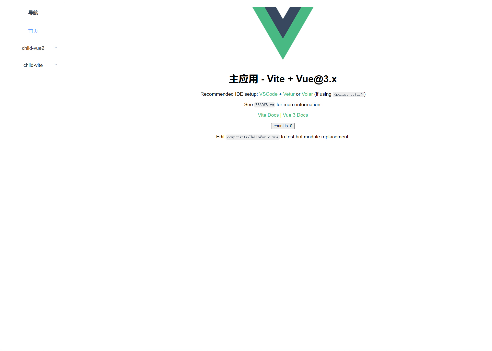

# 简介
micro-app-demo中所有项目都是使用官方脚手架创建的，它们足够精简，你完全可以将其中的demo作为基础进一步开发自己的项目。

# 目录结构
```
.
├── child_apps
│   ├── sidebar          // 子应用 sidebar，公共侧边栏
│   ├── vite-vue3        // 子应用 vite (hash路由)
│   ├── vue2             // 子应用 vue2 (history路由)
├── main_apps
│   ├── vite-vue3        // 主应用 vite (history路由)
├── package.json
└── yarn.lock

19 directories, 5 files
```

# 开始

## 1、安装依赖

```bash
yarn bootstrap
```

如果失败，建议单独进入子目录执行`yarn`安装。


## 2、运行项目
各主应用都监听了3000端口，所以只能同时启动一个主应用，而子应用端口各不相同，可以同时启动。

**1、启动应用**

```bash
yarn dev:all
```

访问：`http://localhost:3000/main-vite`

此时分别运行 `main_app` 以及 `child_apps` 文件夹下的所有子应用。

## 效果如下：



# 补充
- 1、如果你在安装依赖或启动项目时发生错误，可以尝试单独进入每个项目执行操作。
- 2、因为每个主应用都有侧边栏，一次次写太麻烦，所以将侧边栏单独分离出来作为子应用，也就是 `child-sidebar`，实际项目中不需要这样做，侧边栏一般放到主应用中。